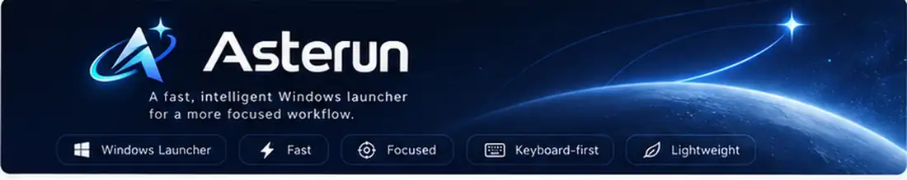
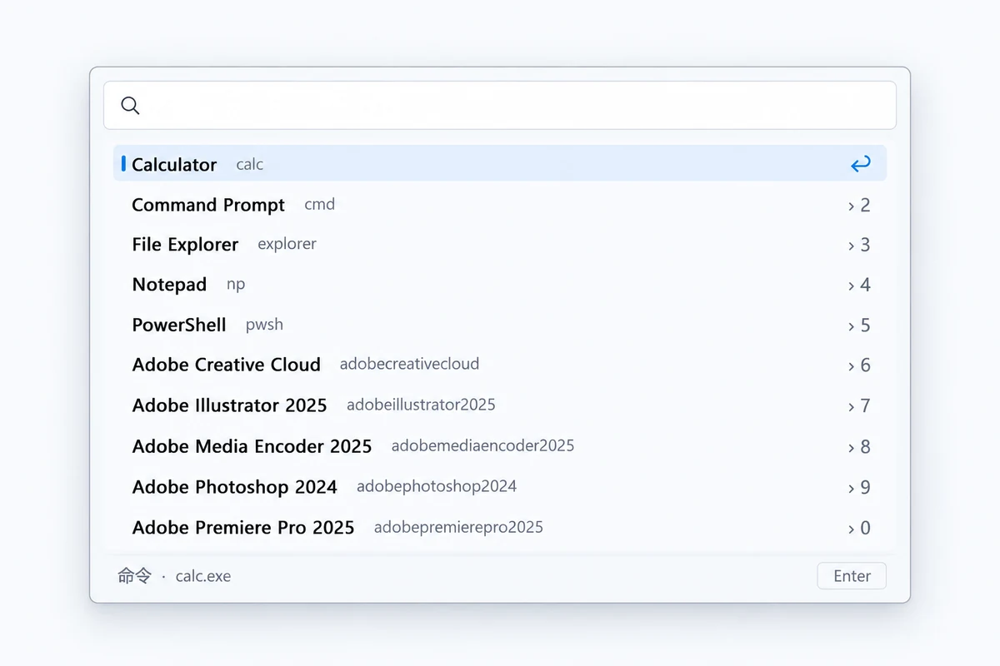
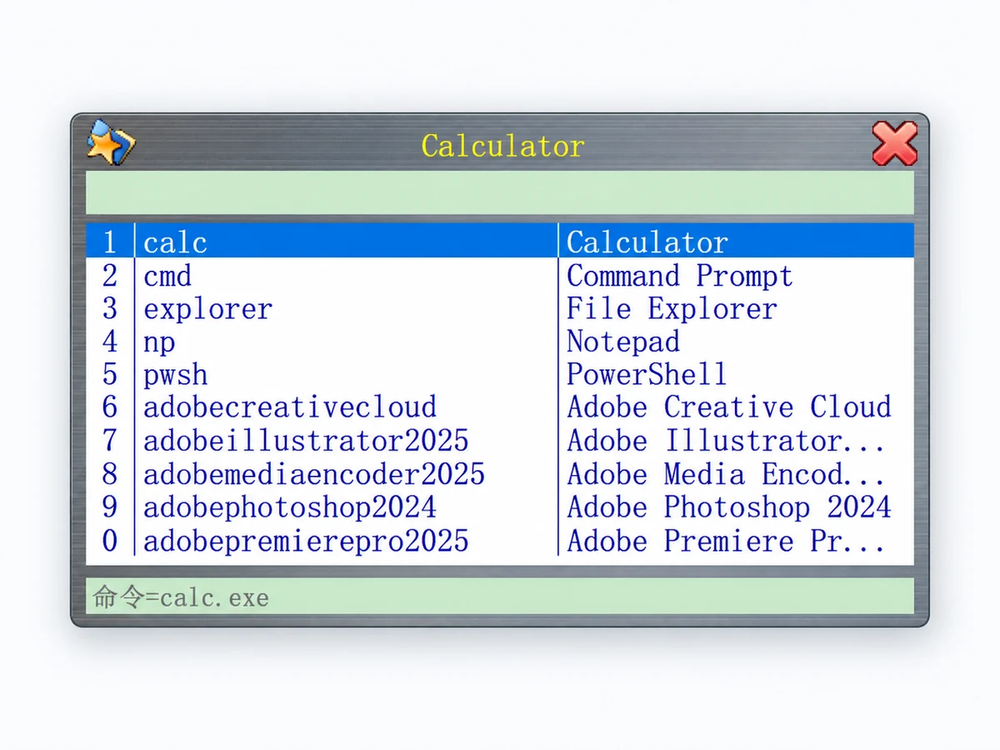
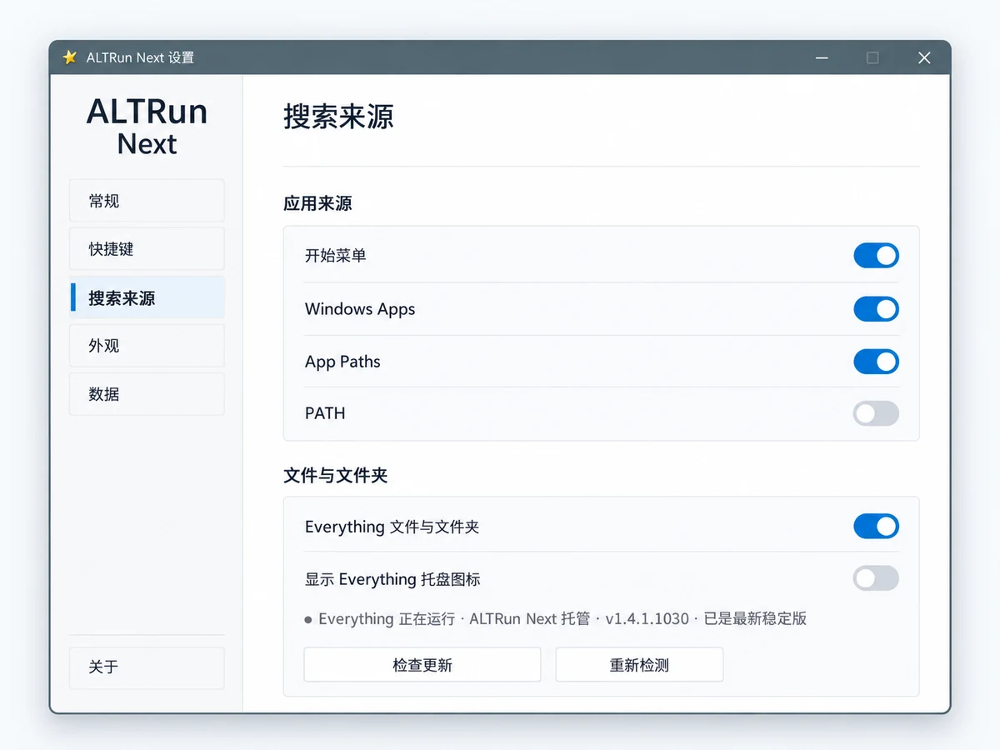

<p align="center">
  
</p>

<h1 align="center">Asterun</h1>

<p align="center">
  <strong>A fast, intelligent, keyboard-first Windows launcher.</strong><br>
  <sub>Launch Faster, Go Further</sub>
</p>

<p align="center">
  <a href="README.md">简体中文</a> ·
  <a href="README.en.md"><strong>English</strong></a>
</p>

<p align="center">
  <a href="https://github.com/Aspeternity/Asterun/releases/latest"></a>
  <a href="https://github.com/Aspeternity/Asterun/actions/workflows/build.yml"></a>
  <a href="LICENSE"></a>
  
  
</p>

<p align="center">
  <a href="#interface-preview">Preview</a> ·
  <a href="#download">Download</a> ·
  <a href="#highlights">Highlights</a> ·
  <a href="#quick-start">Quick Start</a> ·
  <a href="#everything-file-search">Everything Search</a> ·
  <a href="#build-from-source">Build</a> ·
  <a href="CHANGELOG.md">Changelog</a>
</p>

---

## About

Asterun is a native, lightweight, keyboard-first launcher for Windows 10/11, designed to make the **search → focus → launch** loop fast enough to disappear into your daily workflow.

Built with C++23 + Win32, Asterun brings application discovery, pinyin and mixed-language search, usage-aware ranking, smart numeric launch, user shortcuts, optional Everything file/folder search, native update/uninstall support, and a portable data model into one compact launcher experience.

## v1.0.1 — In Development

Asterun 1.0.1 is undergoing real-machine validation, focusing on the transparent brand icon and a fix for the invisible background-process path when the primary hotkey is unavailable. The current stable release remains v1.0.0. Detailed release history is kept in [CHANGELOG.md](CHANGELOG.md).

## Interface Preview

<p align="center">
  
</p>

<p align="center"><sub>Modern Compact — the modern launcher surface</sub></p>

<table>
  <tr>
    <td align="center" width="50%">
      
    </td>
    <td align="center" width="50%">
      
    </td>
  </tr>
  <tr>
    <td align="center"><sub>Classic — the ALTRun-inspired compact launcher</sub></td>
    <td align="center"><sub>Search Sources — Windows providers and managed Everything</sub></td>
  </tr>
</table>

> Preview images are lightly prepared from real Windows product screenshots for presentation on GitHub.

## Download

| Architecture | Stable package |
| --- | --- |
| Windows x64 | [Download Asterun-x64.zip](https://github.com/Aspeternity/Asterun/releases/latest/download/Asterun-x64.zip) |
| Windows ARM64 | [Download Asterun-ARM64.zip](https://github.com/Aspeternity/Asterun/releases/latest/download/Asterun-ARM64.zip) |

- [Latest stable release](https://github.com/Aspeternity/Asterun/releases/latest)
- [SHA-256 checksums](https://github.com/Aspeternity/Asterun/releases/latest/download/SHA256SUMS.txt)
- Supported systems: **Windows 10 / Windows 11**
- Distribution: **portable ZIP**, no installer required

> Extract the ZIP to a normal writable folder before running. Do not run the application directly from inside the archive.

## Highlights

| | |
| --- | --- |
| **Native and lightweight** | C++23 + Win32, designed for fast startup and a small portable footprint. |
| **Two launcher styles** | Classic ALTRun-inspired UI and a Modern Compact Windows-oriented UI. |
| **Keyboard-first workflow** | Default global launcher hotkey is <kbd>Alt</kbd> + <kbd>Space</kbd>. |
| **Smart search** | Fuzzy matching, English initials, Chinese full-pinyin / pinyin-initial matching, and mixed-language queries. |
| **Usage-aware ranking** | Frequency and recency help frequently used results move closer to the top. |
| **Smart numeric launch** | Optional 1–9,0 quick launch with typing-intent arbitration instead of blindly consuming number keys. |
| **Windows app discovery** | Start Menu, packaged/UWP/MSIX apps, App Paths and PATH providers. |
| **Everything integration** | Optional fast file/folder search with Asterun-managed acquisition or compatibility with external Everything installs. |
| **User shortcuts** | Native Shortcut Manager with aliases, arguments, working directories, dynamic input and path conversion. |
| **Portable data** | Settings, shortcuts, usage history and provider cache live under the local `data/` directory. |
| **Native lifecycle tools** | Built-in `Update.exe` and `Uninstall.exe`, with x64 and ARM64 release packages. |
| **Bilingual UI** | Simplified Chinese and English interfaces. |

## Quick Start

1. Download the package for your architecture from the [latest release](https://github.com/Aspeternity/Asterun/releases/latest).
2. Extract the ZIP to a folder of your choice.
3. Run `Asterun.exe`.
4. Press <kbd>Alt</kbd> + <kbd>Space</kbd> to open the launcher.
5. Use the tray menu for **Settings**, **Shortcut Manager**, **About**, and exit controls.

Asterun is portable. On first launch it creates its runtime data directory beside the executable.

## Search Sources

Asterun can combine results from several Windows sources:

- Start Menu shortcuts
- Packaged / UWP / MSIX applications
- App Paths
- Executables available through `PATH`
- User-defined shortcuts
- Optional Everything file and folder results

Sources can be enabled or disabled independently from **Settings → Search Sources**.

## Everything File Search

Everything integration is optional.

When enabled from **Settings → Search Sources**, Asterun can guide you through **Get and start Everything**. The managed flow verifies the downloaded package before use and keeps its own managed service/runtime lifecycle separate from external user-managed Everything installations.

If you already maintain your own compatible Everything installation, Asterun is designed not to take ownership of that external installation.

## Launcher Styles

### Classic

The Classic style preserves the compact ALTRun-inspired layout and keyboard-centric interaction model. It includes authorized original visual/audio assets from classic ALTRun where noted below.

### Modern Compact

Modern Compact keeps the same search engine and result semantics while presenting a cleaner Windows 10/11-oriented shell with DPI-aware sizing and a compact result surface.

Both styles share the same search, ranking, shortcut and provider core.

## Portable Data

Runtime state is stored locally:

```text
Asterun/
├─ Asterun.exe
├─ Update.exe
├─ Uninstall.exe
├─ VERSION
├─ README.md
├─ dict/
├─ third_party/
└─ data/                  # created at runtime
   ├─ settings.json
   ├─ commands.json
   ├─ usage.json
   └─ provider-cache.json
```

Configuration files use versioned schemas, atomic writes and backup recovery. See [Config Core schemas](docs/CONFIG_SCHEMA.md) for implementation details.

## Release Channels

| Channel | Intended use | Link |
| --- | --- | --- |
| **Stable** | Recommended for normal use. Versioned, immutable releases. | [Latest stable](https://github.com/Aspeternity/Asterun/releases/latest) |
| **Development** | Rolling build from the latest successful `main` CI. May contain unfinished changes. | [dev-latest](https://github.com/Aspeternity/Asterun/releases/tag/dev-latest) |

Official release assets include x64/ARM64 portable ZIPs, SHA-256 checksums and an update manifest.

## Build from Source

### Requirements

- Windows 10 or Windows 11
- Visual Studio 2022 with **Desktop development with C++**
- CMake **3.24+**
- Git

### x64

```powershell
cmake -S . -B build -A x64
cmake --build build --config Release
```

### ARM64

Use a Visual Studio toolchain with ARM64 support:

```powershell
cmake -S . -B build-arm64 -A ARM64
cmake --build build-arm64 --config Release
```

CMake fetches pinned build dependencies used by the project. Release artifacts are additionally checked by CI for version consistency, package contents and runtime smoke behavior.

## Documentation

| Document | Purpose |
| --- | --- |
| [CHANGELOG.md](CHANGELOG.md) | Release history and notable changes |
| [ROADMAP.md](ROADMAP.md) | Completed milestones and future direction |
| [docs/CONFIG_SCHEMA.md](docs/CONFIG_SCHEMA.md) | Portable configuration and migration contract |
| [docs/UPDATE_SYSTEM.md](docs/UPDATE_SYSTEM.md) | Native updater architecture |
| [docs/EVERYTHING_COMPATIBILITY.md](docs/EVERYTHING_COMPATIBILITY.md) | Everything integration and compatibility |
| [docs/V1.0_RELEASE_VALIDATION.md](docs/V1.0_RELEASE_VALIDATION.md) | 1.0.0 release validation contract |
| [THIRD_PARTY_NOTICES.md](THIRD_PARTY_NOTICES.md) | Third-party notices and licenses |

Long-form Alpha/Beta development notes live in the [changelog](CHANGELOG.md) rather than on the project homepage.

## Feedback and Bug Reports

Found a reproducible bug or compatibility problem? Please open a [GitHub Issue](https://github.com/Aspeternity/Asterun/issues).

Useful reports include:

- Asterun version
- Windows version and architecture
- Reproduction steps
- Expected vs. actual behavior
- Screenshots or relevant error codes when available

## Acknowledgements

Asterun is an independent implementation inspired by classic ALTRun.

Classic mode includes the original launcher background and two corner glyph assets, and the product uses the original ALTRun application icon and `Popup.wav`. These original assets are included with permission from the original author.

Everything is a third-party product by voidtools. Additional dependency and attribution information is listed in [THIRD_PARTY_NOTICES.md](THIRD_PARTY_NOTICES.md).

## License

The Asterun source code is released under the [MIT License](LICENSE).

Bundled third-party components and original ALTRun assets remain subject to their respective licenses, notices and permissions.

---

<p align="center">
  <strong>Asterun</strong><br>
  Fast enough to disappear into your workflow.
</p>
