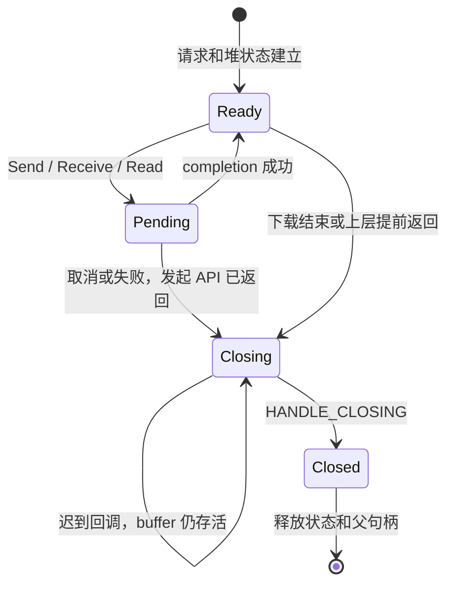

# Batch 2.5 — UpdateManager HTTP cancellation race

基线：已验收 Batch 2 `5db3bce`。仅修改更新器 HTTP transport；Everything transport、App 生产代码、安装器及回滚逻辑保持独立且不变。

## 审查结果与保留语义

| 路径 | 现有行为与本批约束 |
|---|---|
| metadata | `DownloadTextWithRetry`：初次请求后最多重试两次，等待 250/750ms；仅原有 transient HTTP/timeout 错误重试，停止不重试 |
| redirect | HTTPS URL、原有代理设置；每个 request 保留 `DISALLOW_HTTPS_TO_HTTP`，设置失败仍报原生错误 |
| manifest | Stable/Development 来源、schema、256KiB 上限、解析、自动检查记录时机不变；Stable 404 的 legacy metadata fallback 保留 |
| package | 不自动重试；128MiB 上限；原有下载进度和错误分类不变 |
| read | metadata 16KiB / package 64KiB 固定大小直接读取至 EOF；没有 QueryDataAvailable 阶段，不为测试增加生产查询 |
| timeout | resolve/connect/send/receive = 5000/5000/15000/15000ms；保留 SetTimeouts 返回值检查 |
| watchdog | App 原有绝对检查期限、代际失效、CheckTimedOut 发布和 request_stop 不变；transport 将停止转成 ERROR_CANCELLED |
| 临时文件 | PrepareUpdate 仍删除失败/取消的 `.download`；成功后原有 SHA256、rename、解包和 staging 检查不变 |
| install handoff | verified archive、hash、staging、ReadyToInstall 以及随后安全提权、health event、安装/回滚/恢复完全不改 |

## 生命周期

更新器私有 `UpdateHttpRequest.hpp` 使用局部 async WinHTTP。上层接口仍为顺序调用，没有通用 HTTP framework、跨模块复用或新增线程池。

- 下载线程拥有 request；只从其唯一 Close 路径关闭，关闭前以 exchange 清空本地 handle。
- stop callback 强引用 heap state，只设取消和通知条件变量。它不接触 WinHTTP handle。
- 下载线程在发起 API 返回后等待 completion 或取消；取消不能让另一个线程并发关闭尚未返回的 API。
- 静态 WinHTTP callback 只发布状态。context 不指向 App/UpdateManager/栈变量。
- 读缓冲区由 heap state 拥有，异步 ReadData 输出参数为 nullptr；READ_COMPLETE 后才使用数据。
- Close 后仍接受迟到 REQUEST_ERROR/completion，等待最终 HANDLE_CLOSING 后释放 context/buffer，再释放 connection/session。通知在锁内完成，最终 callback 解锁后不再访问状态。
- 正常完成与停止竞争，操作完成边界观察到取消则返回 ERROR_CANCELLED；已返回的成功不会被迟到停止回写。watchdog 的对外错误仍由既有 App generation 规则仲裁。

## 与 Batch 2 的差异

生命周期所有权原则一致，但实现文件互相独立。更新器不引入 Everything 的 Available 查询；保留固定读取大小、不同 timeout 数值、redirect policy、metadata retry、Stable fallback 和 package 的无重试策略。

## 测试

- `update_http_transport_tests`：直接包含生产 UpdateManager.cpp，仅测试 TU 替换 WinHTTP。metadata/package Send、Receive、Read 取消，API 尚未返回时停止，同步/异步失败，timeout/context/callback/redirect 安装失败，提前停止、完成后停止，Close 后迟到写入/error/completion，最终唯一关闭，64 轮 watchdog/退出/完成竞争。
- 专属语义回归：连续 Stable/Development 检查、503 重试成功和耗尽、403 不重试、Stable 404 fallback、非法 manifest、两个公开入口的各阶段取消、package 失败不重试与临时文件清理；真实 ZIP 下载内容经过真实 SHA256 和解包进入 ReadyToInstall，验证 stage 顺序与交接数据。
- `update_http_runtime_tests`：36 次实际 WinHTTP 回环请求，正常成功、静默响应头/正文取消、完成后停止、重复 Close 与 stop+join；取消退出小于 3 秒断言只针对该 transport 线程。
- `AppLifecycleRuntimeTests`：在现有测试 friend 中验证原有 watchdog 和完成的两种确定顺序及竞争，旧代际不能覆盖 CheckTimedOut，工作线程最终被 join。
- 全量 CI 继续运行既有 upgrade matrix、update policy、更新事务/回滚、Windows runtime 及 x64/ARM64 构建包验证。结果见本批 PR。

验证边界：本机回环 HTTP 不等同公网 TLS/代理/真实弱网；Windows 10 API baseline Runner 不等同 Win10 实机；ARM64 只验构建包。本批不声称已完成交互式 UAC/真实机器升级人工验收。

正常升级无预期用户可见变化。变化仅为取消同步网络请求时消除并发关闭竞态；安全关闭仍等待 WinHTTP 最终通知，没有强制释放 context 的超时逃生路径。

依据：
- https://learn.microsoft.com/en-us/windows/win32/winhttp/concurrency-in-winhttp
- https://learn.microsoft.com/en-us/windows/win32/api/winhttp/nf-winhttp-winhttpclosehandle
