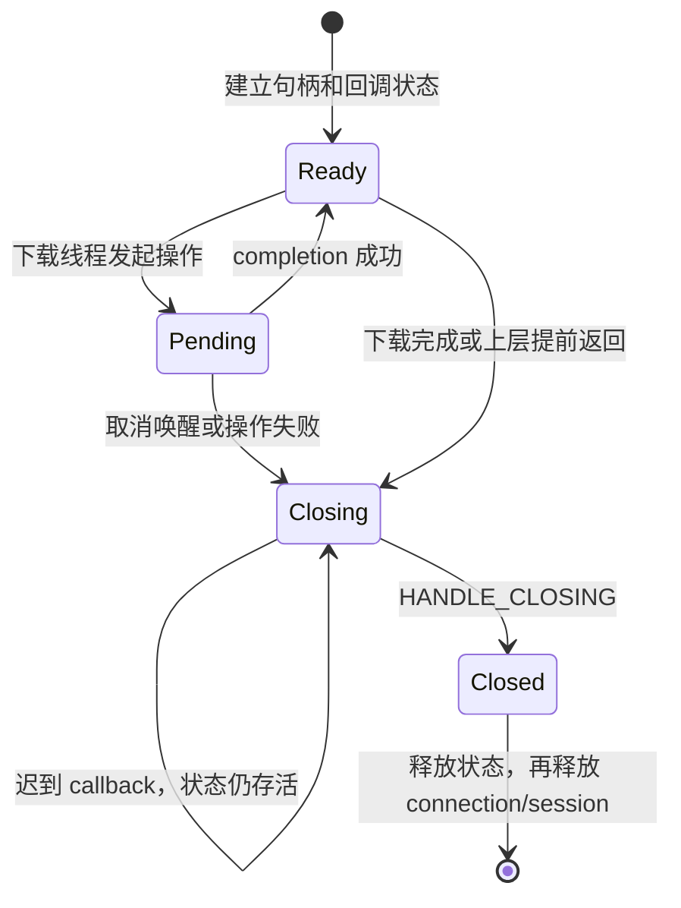

# Batch 2 — Everything HTTP 取消与生命周期

基线：Batch 1 的 `616f992`；范围仅 A3。上层 Bootstrapper、App、Provider 和 UI 状态机不变。

## 设计

`EverythingHttpRequest.hpp` 是 Everything 私有 transport 适配器。已有下载线程仍依次执行 Send → Receive → Available → Read；只有 WinHTTP session 内部使用 `WINHTTP_FLAG_ASYNC`，没有新增应用线程池。

- 下载线程独占 request handle；所有 WinHTTP 调用和唯一的 `Request::Close()` 均由该线程执行。
- 每次操作先设置期望 completion，再在不持有状态锁时发起 WinHTTP 调用，兼容 inline callback；然后等待 completion 或取消信号。
- `stop_callback` 强引用 heap state，只设 cancelled 并唤醒等待，不调用 WinHTTP、不关闭句柄、不释放状态。
- 静态 WinHTTP callback 的 context 指向请求拥有的 heap state，不指向 App、Bootstrapper 或栈对象。callback 只记录结果、通知条件变量。
- 取消或错误时，先让发起 API 返回，再由下载线程关闭 request。`Close()` 取走 handle 后清空成员；后续析构不再重复关闭。
- 安装 callback 后的关闭必须等待 `HANDLE_CLOSING`。等待期间允许迟到的错误/读完成通知；heap state 和读缓冲区仍有所有者。最终 callback 在锁内通知，解锁后不再访问 state。
- 正常下载退出同样先排空 request callback，再按 request → connection → session 顺序释放。callback 安装前失败的请求没有异步 I/O，可直接释放。
- 数据查询和读取的异步输出参数传 `nullptr`，结果从 callback 取得。读缓冲区放在 request state 中，下载线程在读取完成后才复制文本或写文件。

## 生命周期

取消只发信号；上图所有进入 Closing 的操作都经过同一下载线程的 Close。正常完成与停止竞争时，在操作完成边界观察到取消则返回 `ERROR_CANCELLED`；操作已完成并返回后的停止由下一次操作/既有上层取消检查处理。

## 行为约束

下载 URL、稳定版本获取/回退、HTTP 状态处理、包大小限制、校验、安装/服务策略、进度 stage 和文案不变。resolve/connect/send/receive 保持 5000/5000/10000/10000ms；新增 SetTimeouts 失败检查，失败时保留原生错误。网络失败仍由原有 ManifestDownloadFailed/PackageDownloadFailed 路径处理。

预期用户可见变化仅为取消/退出时不再等待正在进行的网络阶段超时，以及 timeout 配置失败时明确结束请求。磁盘写入、安装和服务操作的取消时机不在本批优化范围。停止没有引入新的强制退出时限；安全清理仍需等待 WinHTTP 最终关闭通知。

## 验证

- `everything_http_transport_tests`：直接编译生产 Bootstrapper，故障注入仅存在于测试 TU；覆盖文本/文件两条路径、四阶段取消、inline completion、同步/异步错误、timeout/context/callback 安装失败、提前停止、完成后停止、迟到读写/error callback、唯一关闭、64 轮完成/取消竞争及 request_stop + join。
- `everything_http_runtime_tests`：36 次真实 WinHTTP 回环请求，覆盖正常正文、服务端不返回响应头/正文时的取消、最终关闭与退出。测试使用本机 HTTP，产品仍强制 HTTPS，未添加证书绕过。
- CI：两组 Windows 任务均加入以上目标；x64/ARM64 产品构建、包验证及已有 Runtime Smoke 保留。
- 最终运行结果记录在本批 PR 验收说明中；本设计文档不代替 CI 结果。

参考：
- https://learn.microsoft.com/en-us/windows/win32/winhttp/concurrency-in-winhttp
- https://learn.microsoft.com/en-us/windows/win32/api/winhttp/nf-winhttp-winhttpclosehandle
- https://learn.microsoft.com/en-us/windows/win32/api/winhttp/nf-winhttp-winhttpquerydataavailable
